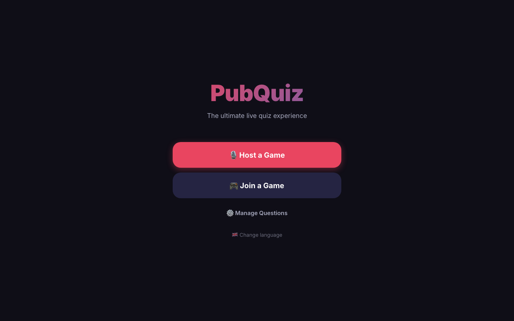
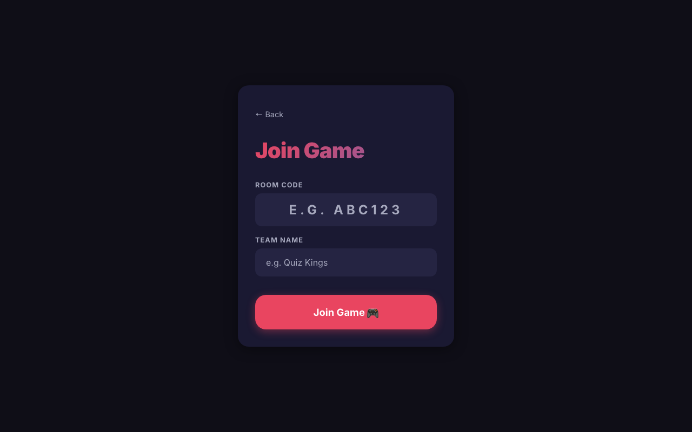
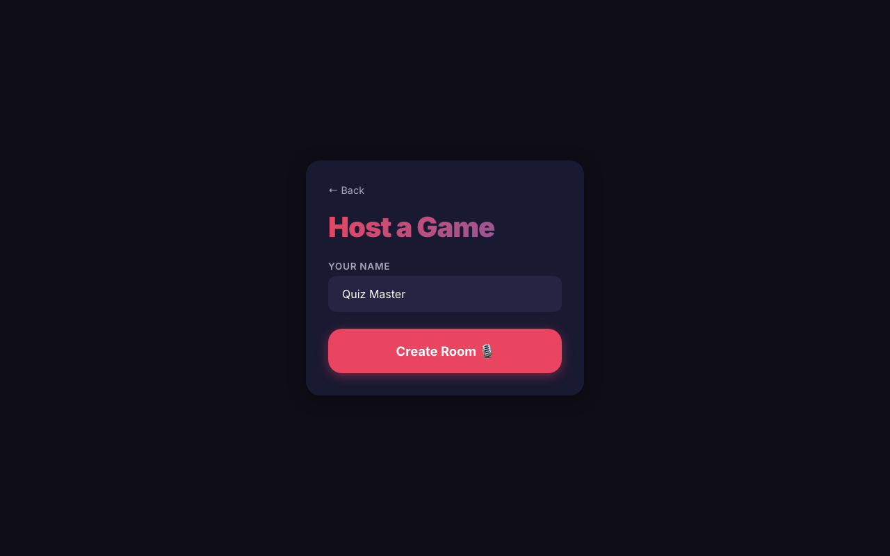
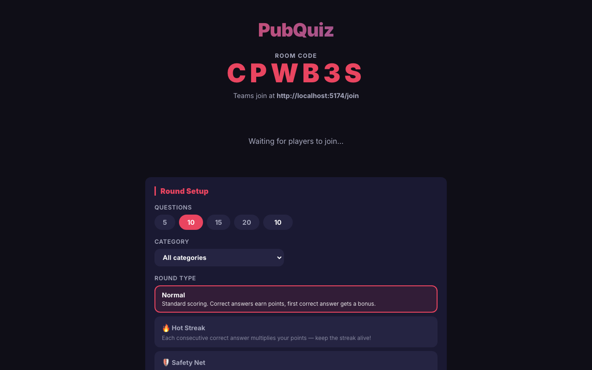
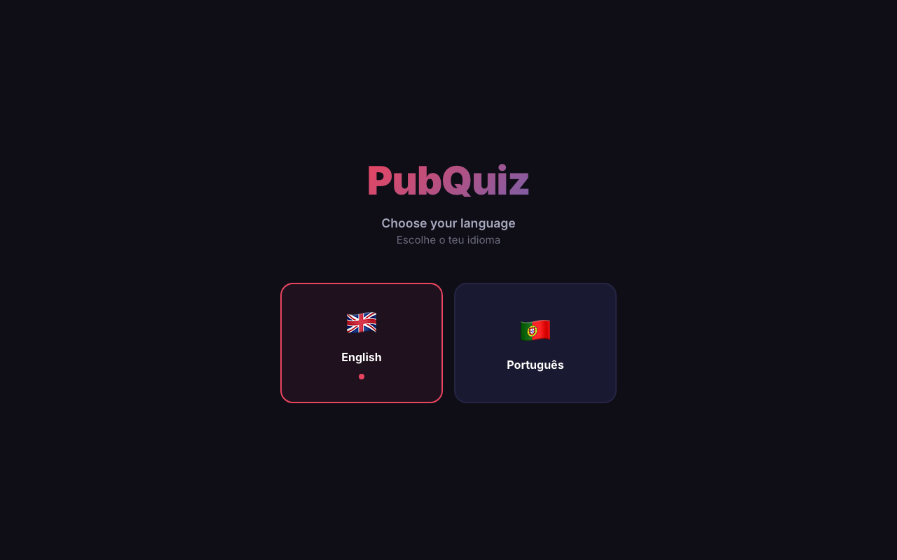
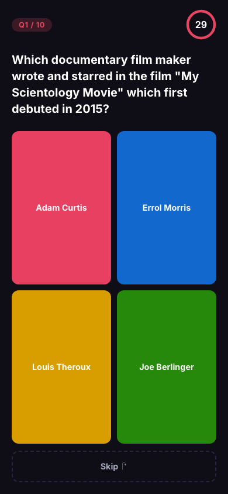
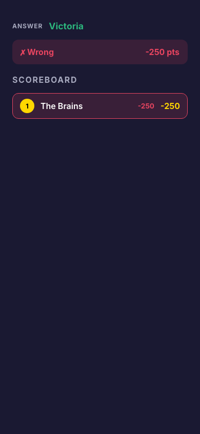
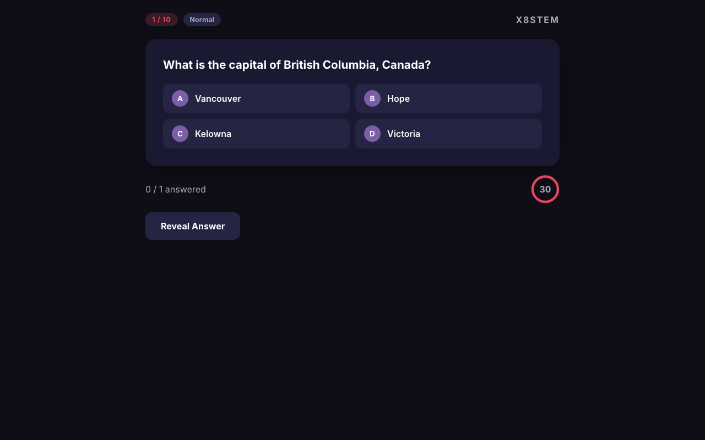
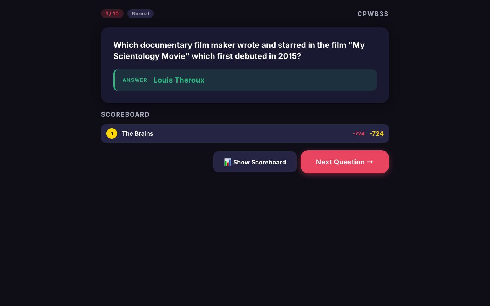
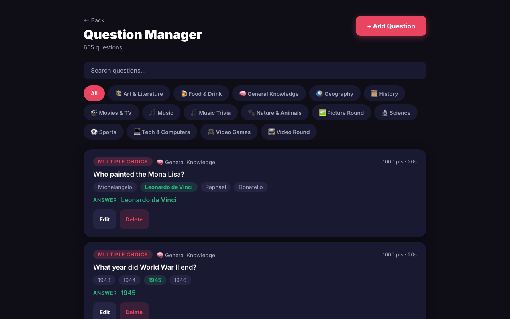

# PubQuiz

A real-time multiplayer pub quiz game. A host controls the game from one device while teams join on their own devices to answer questions. Designed for in-person events with an optional big-screen projection view.

---

## Screenshots

| Home | Join | Host Setup |
|---|---|---|
|  |  |  |

| Host Lobby & Round Setup | Language |
|---|---|
|  |  |

| Player Lobby | Player — Question | Player — Results |
|---|---|---|
|  |  |  |

| Host — Question | Host — Results |
|---|---|
|  |  |

| Question Manager |
|---|
|  |

---

## Features

- **Live multiplayer** — host creates a room, teams join with a 6-character code
- **Question manager** — full CRUD UI to add, edit, and delete questions without touching a database
- **Multiple question types** — Multiple Choice, Music, Video, Image
- **Big screen view** — a separate projection URL (`/screen/:code`) for TVs or projectors; connects as an observer only (does not count as a team)
- **Host as player** — host can optionally compete as their own team with a custom team name, and appears on the scoreboard
- **Rich scoring system** — speed bonuses, first-answer bonuses, wrong-answer penalties, skip mechanics, and round types
- **Skip mechanic** — teams can skip questions, but consecutive skips increase the penalty for future wrong answers; blocked after 4 skips in a row
- **Round types** — host sets the scoring mode per round; it applies for the entire round and can only be changed between rounds

---

## Scoring System

### Base formula (correct answer)

```
points = round((basePoints + speedBonus + firstAnswerBonus) × roundMultiplier)
```

| Component | Value |
|---|---|
| Base points | Set per question (default 1 000) |
| Speed bonus | Up to +50% of base, linear from answer time 0 → time limit |
| First-answer bonus | +100 flat (first team to answer correctly per question) |
| Wrong-answer penalty | −250 pts (suppressed in Safety Net round) |

### Skip penalty

Skipping is allowed but punishes teams that answer wrong afterwards. Consecutive skips stack the penalty multiplier on the next wrong answer. After 4 consecutive skips, the team is **forced to answer** the next question — if they don't, they receive the full penalty automatically when time runs out.

| Consecutive skips | Wrong-answer penalty multiplier |
|---|---|
| 0 | ×1.00 (−250 pts) |
| 1 | ×1.25 (−313 pts) |
| 2 | ×1.50 (−375 pts) |
| 3 | ×1.75 (−438 pts) |
| 4 (max — must answer) | ×2.00 (−500 pts) |

Answering (correctly or wrongly) resets the consecutive skip count to 0. The scoreboard shows each team's current skip count so other teams are aware.

### Round types

The host sets a round type before starting the round. It applies for **all questions in that round** and cannot be changed mid-round.

| Round type | Effect |
|---|---|
| **Normal** | Standard scoring |
| **🔥 Hot Streak** | Each consecutive correct answer adds ×0.25 to that team's multiplier (stacks up to ×2.0) |
| **🛡️ Safety Net** | Wrong-answer penalty is suppressed — teams cannot lose points this round |
| **🐺 Lone Wolf** | Only the **first** team to answer correctly earns points; all others get 0 |
| **⚡ Double Down** | All correct-answer points are doubled |

---

## Tech Stack

| Layer | Technology |
|---|---|
| Frontend | Vue 3, Vite 5, Pinia, Vue Router |
| Backend | Node.js (v26+), Express, Socket.io |
| Database | Supabase (PostgreSQL) |
| Real-time | Socket.io rooms (one room per game session) |

---

## Project Structure

```
pub-quiz/
├── backend/
│   └── src/
│       ├── index.js              # Express + Socket.io server entry point
│       ├── db/
│       │   ├── client.js         # Supabase client
│       │   └── schema.sql        # Database schema + seed data
│       ├── routes/
│       │   ├── questions.js      # REST API: CRUD for questions and categories
│       │   └── media.js          # Media URL helpers
│       └── socket/
│           ├── handlers.js       # All Socket.io event handlers
│           └── gameSession.js    # In-memory game session state + scoring logic
│
└── frontend/
    └── src/
        ├── main.js
        ├── App.vue
        ├── router/index.js
        ├── stores/
        │   ├── game.js           # Game state (status, questions, scoreboard, round type)
        │   └── player.js         # Local player identity
        ├── composables/
        │   └── useSocket.js      # Singleton Socket.io instance
        ├── components/
        │   ├── ScoreTable.vue    # Full-screen scoreboard overlay (host-triggered)
        │   ├── Scoreboard.vue    # Inline scoreboard list + podium
        │   ├── QuestionCard.vue  # Question display (host + screen views)
        │   ├── Timer.vue         # Countdown timer
        │   └── PlayerList.vue    # Lobby team list
        └── views/
            ├── HomeView.vue      # Landing page
            ├── HostView.vue      # Host control panel
            ├── JoinView.vue      # Team join screen
            ├── PlayView.vue      # Team answer screen
            ├── ScreenView.vue    # Big-screen projection view
            └── ManageView.vue    # Question manager (add / edit / delete)
```

---

## Getting Started

### Prerequisites

- Node.js v18 or higher (v26 recommended — use [nvm](https://github.com/nvm-sh/nvm))
- A [Supabase](https://supabase.com) project

### 1. Clone the repo

```bash
git clone <repo-url>
cd pub-quiz
```

### 2. Set up the database

1. Open your Supabase project → SQL Editor
2. Run the contents of `backend/src/db/schema.sql` to create all tables and seed sample questions

### 3. Configure the backend

Create `backend/.env`:

```env
SUPABASE_URL=https://your-project.supabase.co
SUPABASE_SERVICE_KEY=your-service-role-key
CORS_ORIGIN=http://localhost:5174
PORT=3001
```

### 4. Install dependencies

```bash
# Backend
cd backend && npm install

# Frontend
cd ../frontend && npm install
```

### 5. Run in development

In two separate terminals:

```bash
# Terminal 1 — backend (port 3001)
cd backend
npm run dev

# Terminal 2 — frontend (port 5174)
cd frontend
npm run dev
```

Then open:
- **Game**: `http://localhost:5174`
- **API**: `http://localhost:3001`

---

## How to Play

### Host
1. Go to `/` → **Host a Game**
2. Enter your name; optionally enable **Play as a team** to compete as your own team with a custom name
3. Click **Create Room** and share the 6-character room code with teams
4. In the lobby, configure the round: number of questions, category, and **round type**
5. Optionally open the **Screen View** link on a projector/TV
6. Click **Start Game** when everyone has joined
7. Between rounds, reconfigure round settings (including round type) before starting the next round
8. Click **Show Scoreboard** at any time to reveal the full overlay on all screens

### Teams
1. Go to `/join` on any device (or scan the QR code on the screen view)
2. Enter the room code and a team name
3. Answer questions before time runs out
4. Use **Skip** to pass a question — but watch out: consecutive skips increase the penalty for wrong answers, and you are forced to answer after 4 skips in a row

### Big Screen
- Open `/screen/:code` on any TV or projector for a lobby view, live question display, and results

---

## Question Manager

Go to `/manage` to add, edit, and delete questions without touching the database directly.

- Supports **Multiple Choice** (up to 4 options, click to mark the correct answer), **Music**, **Video**, and **Image** types
- Filter questions by category
- Set custom **point values** and **time limits** per question

---

## Socket Events Reference

### Client → Server

| Event | Payload | Description |
|---|---|---|
| `create_session` | `{ nickname, teamName? }` | Host creates a room; `teamName` opts the host in as a competing team |
| `join_session` | `{ code, nickname }` | Team joins a room |
| `join_screen` | `{ code }` | Screen view joins the room as an observer (no player record created) |
| `start_game` | `{ code, numQuestions, roundType, categoryId? }` | Host starts a round |
| `submit_answer` | `{ code, answer }` | Team submits an answer |
| `skip_question` | `{ code }` | Team skips the current question |
| `reveal_results` | `{ code }` | Host manually reveals the answer |
| `next_question` | `{ code }` | Host advances to the next question |
| `show_scoreboard` | `{ code }` | Host triggers the scoreboard overlay on all screens |
| `hide_scoreboard` | `{ code }` | Host dismisses the scoreboard overlay |
| `end_game` | `{ code }` | Host ends the game |
| `set_language` | `{ code, language }` | Host changes the room language (lobby only) |

### Server → Client

| Event | Payload | Description |
|---|---|---|
| `session_created` | `{ code, player, players, language, hostPlaysAsTeam }` | Sent to host after room creation |
| `joined_session` | `{ code, player, players, language }` | Sent to joining team or screen view |
| `player_joined` | `{ player, players }` | Broadcast when a team joins |
| `player_left` | `{ playerId, players }` | Broadcast when a team disconnects |
| `game_started` | `{ totalQuestions, roundType, language }` | Broadcast when a round begins |
| `question` | `{ index, total, question, roundType }` | Broadcast each new question |
| `answer_received` | `{ isCorrect, pointsAwarded, consecutiveSkips, correctStreak, forcedPenalty? }` | Sent to answering team |
| `skip_confirmed` | `{ consecutiveSkips, penaltyMultiplier }` | Sent to skipping team |
| `player_answered` | `{ totalAnswered, totalPlayers, ... }` | Sent to host as teams answer |
| `results_revealed` | `{ correctAnswer, scoreboard, playerResults, roundType, isLastQuestion }` | Broadcast after reveal |
| `show_scoreboard` | `{ scoreboard, roundType }` | Broadcast to trigger overlay on all screens |
| `hide_scoreboard` | — | Broadcast to dismiss overlay |
| `language_changed` | `{ language }` | Broadcast when host changes the room language |
| `game_ended` | `{ scoreboard }` | Broadcast when game ends |

---

## Environment Variables

| Variable | Required | Description |
|---|---|---|
| `SUPABASE_URL` | Yes | Your Supabase project URL |
| `SUPABASE_SERVICE_KEY` | Yes | Supabase service role key (keep secret) |
| `CORS_ORIGIN` | Yes | Frontend URL (e.g. `http://localhost:5174`) |
| `PORT` | No | Backend port (default: `3001`) |

> **Never commit `.env` to version control.** The `.gitignore` already excludes it.

---

## Roadmap

See [TODO.md](./TODO.md) for the full backlog. Planned highlights:

- Spotify integration for music round questions (30s preview clips)
- YouTube integration for video round questions
- Reconnect handling (teams rejoin and keep their score)
- CSV bulk import for questions
- Production deployment (Vercel + Railway/Render)
